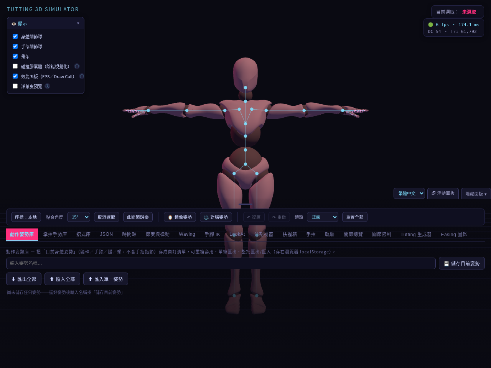
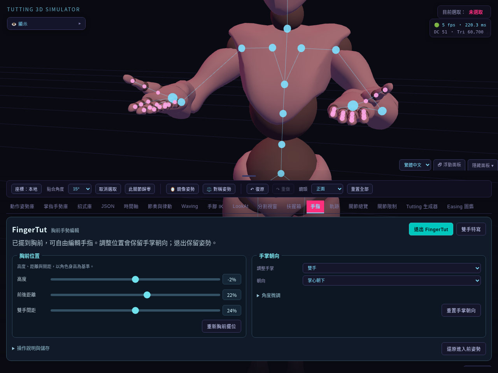
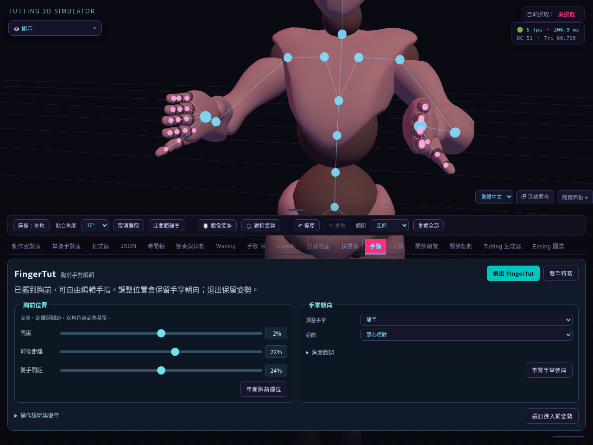
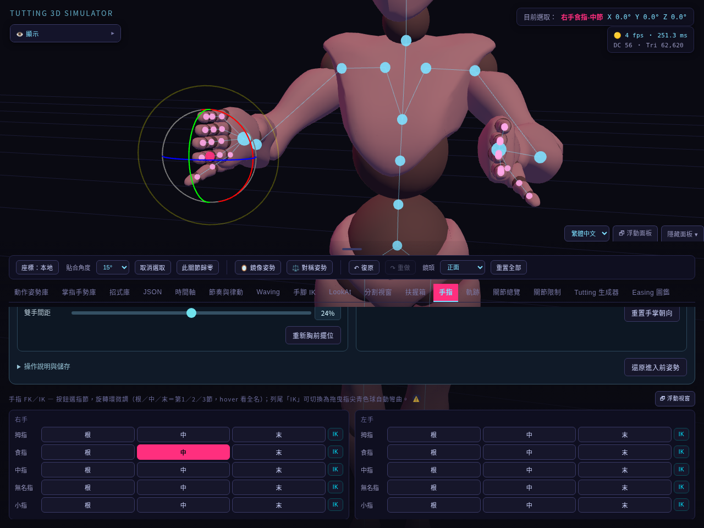
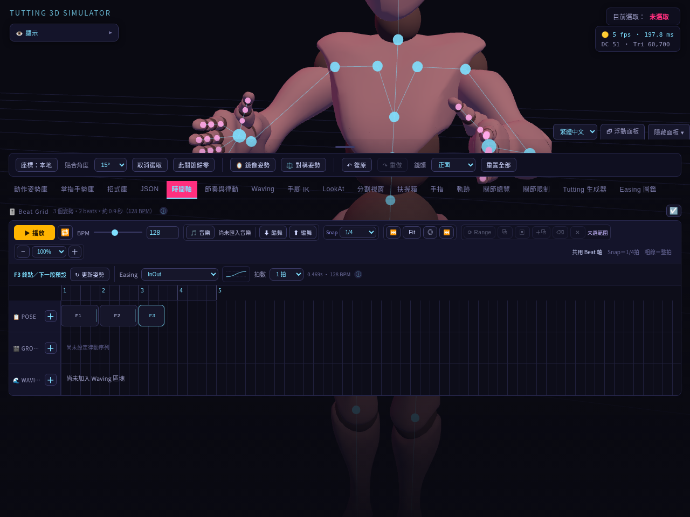
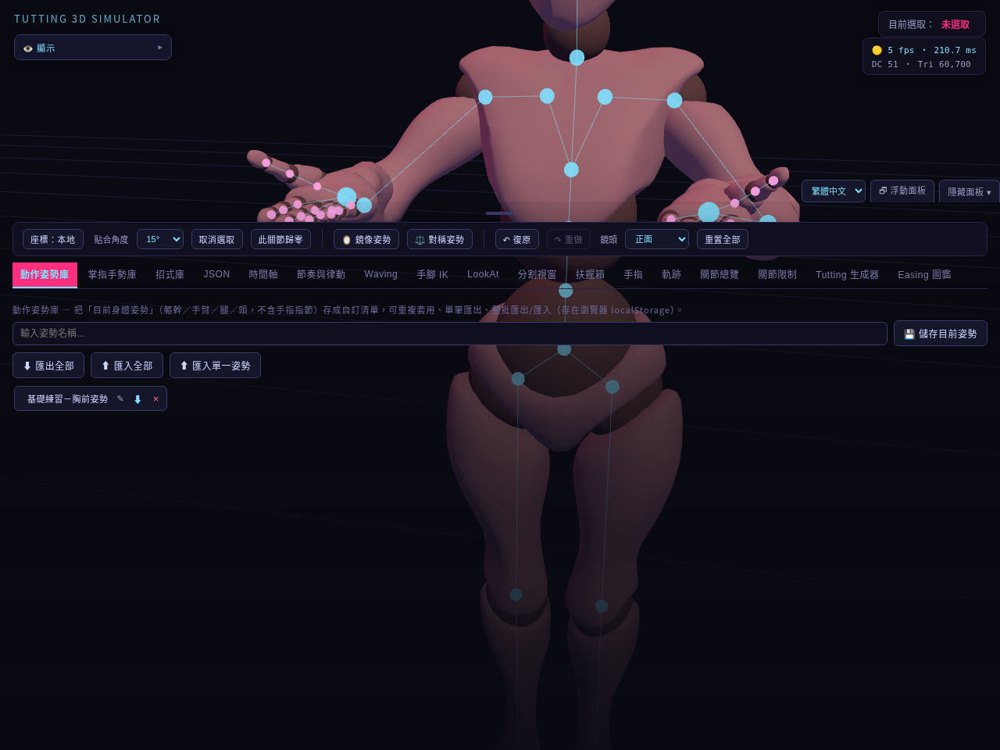
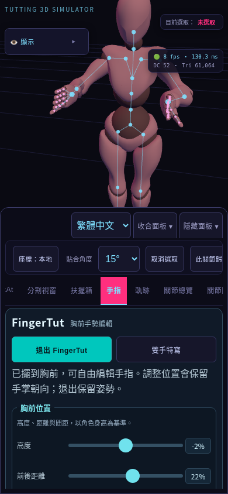

# 基礎圖文操作手冊

適用於 3D Tutting Simulator 的繁體中文介面。第一次使用，建議先完成「胸前手勢 → 三個姿勢 → 播放 → 匯出」的練習，再嘗試 IK、Wave 與生成器。

## 1. 開啟程式

最方便的方式是開啟 [線上版](https://juynwei2019.github.io/3D-TUTTING-SIMULATOR-2077/)，等待角色載入。手機也使用同一個網址。

下載專案後，使用 VS Code 開啟**整個專案資料夾**，再以 Live Server 擴充套件開啟根目錄的 `index.html`。也可在 VS Code 終端機輸入：

```sh
python3 -m http.server 8000
```

再開啟 `http://localhost:8000/`。Windows 若只有 Python Launcher，可改用 `py -m http.server 8000`。

保留 `src/`、`styles/` 與 `index.html` 的相對位置，使用 HTTP 網址開啟。程式需要網路載入 Three.js 與人體模型。一般操作不需要執行 `npm ci`；修改程式、打包與自動測試的方式見 [README](../README.md)。

## 2. 認識畫面與鏡頭



**圖 1**：中央是 3D 角色，左上是「顯示」設定，右上顯示目前選取的關節，底部是操作面板。

| 位置／控制 | 用途 |
| --- | --- |
| 左上「顯示」 | 開關身體關節、手部關節、骨架等輔助顯示；按標題收合 |
| 「繁體中文／English」 | 切換介面語言，重新載入仍會沿用 |
| 共用操作列 | 角度貼合、取消選取、此關節歸零、鏡像、對稱、復原／重做 |
| 「鏡頭」選單 | 快速切正面、側面、俯視或單手特寫 |
| 分頁列 | 進入手指、時間軸、姿勢庫等功能 |

在 **3D 畫面空白處**拖曳滑鼠左鍵可轉動鏡頭；滾輪拉近／拉遠，右鍵拖曳平移。拖曳關節或操作環時會編輯角色，請先分清楚點到哪裡。

面板太擋畫面時，可按「隱藏面板」；按畫面上的「☰ 面板」重新顯示。桌面也可按 H 切換，但輸入名稱時請使用按鈕。桌面底部面板可拖曳上緣把手調整高度。

## 3. 快速進入 FingerTut 胸前工作區



**圖 2**：不用逐一搬動手臂，直接開始編輯胸前手勢。

1. 點「手指」分頁，再按「開啟 FingerTut」。
2. 雙手自動放到胸前，預設掌心朝下、指尖朝前，鏡頭切成雙手特寫。
3. 在「胸前位置」卡片使用「高度」「前後距離」「雙手間距」調整位置，滑桿放開後重新擺位。
4. 視角跑掉時按「雙手特寫」；修改身體姿勢後，可按「重新胸前擺位」。

卡片下方的「操作說明與儲存」可展開查看詳細說明。

開啟模式會停止時間軸、Wave 與律動預覽，並解除雙臂／手指 IK 與手掌朝向接管。若雙手正在扶握箱子，先到「扶握箱」取消扶握。

「退出 FingerTut」會**保留做好的姿勢**；「還原進入前姿勢」則回到進入模式前的姿勢及鏡頭。模式開關與鏡頭不會存入編舞檔，要保存成果請新增拍點。

## 4. 調整手掌方向與手指



**圖 3**：先選要調整哪一隻手，再選方向。

1. 在「手掌朝向」卡片的「調整手掌」選「雙手」「右手」或「左手」。
2. 在「朝向」選掌心朝下、朝上、相對、朝外或朝向鏡頭。
3. 展開「角度微調」，用「掌心翻轉」「指尖抬低」「左右偏轉」微調。
4. 不滿意時按「重置手掌朝向」，只重置所選手掌，保留位置與手指形狀。

選新的方向預設會將所選手掌的微調角度歸零；「朝向鏡頭」對準按下當時的鏡頭，不會一直追蹤鏡頭。



**圖 4**：在手指列表按「根／中／末」，選第 1／2／3 指節；拖曳角色旁的彩色旋轉環調整角度。右上會顯示所選指節與角度。

- 初學時保留「座標：本地」與 15° 貼合；需要細調時將「貼合角度」改成「關閉」。
- 按「此關節歸零」只還原所選關節；做錯可按「↶ 復原」，再按「↷ 重做」取回。
- 也可按該手指列尾的「IK」，再拖曳青色指尖目標球，讓整根手指自動彎曲。回到旋轉環編輯前，先關閉該手指 IK。
- 手指列表在面板下方，沒看到時請捲動面板內容。

一般身體姿勢也可以點選身體關節球，或到「關節總覽」點關節列，再拖曳旋轉環。找不到關節球時先檢查「顯示」設定。

## 5. 入門練習：做出三個姿勢並播放



**圖 5**：時間軸的 POSE 軌道存放姿勢；左側的「＋」把目前 3D 姿勢記成一個拍點。

1. 在 FingerTut 設定「掌心朝下」。
2. 切到「時間軸」，按 **POSE 左側「＋」**，加入第一個姿勢。
3. 回「手指」改成「掌心相對」，再回時間軸按「＋」。
4. 改成「掌心朝外」，再加入第三個姿勢。
5. 按「▶ 播放」觀看連接效果；再按「■ 停止」結束。至少要有兩個姿勢才能播放。

點選 POSE 片段可選取該姿勢。選好後，在「轉場」設定 Easing 與拍數，控制**這個姿勢到下一個姿勢**的過渡；BPM 控制每分鐘拍數。先用預設值熟悉操作即可。

修改 3D 姿勢後，要更新已選取的拍點，請按「↻ 更新姿勢」；按「＋」會新增拍點。有選取時插在其後，沒選取時加到尾端。最後一個姿勢是終點，自己的轉場值作為下一段的預設。

想讓素材左右對調，可用「鏡像姿勢」；「對稱姿勢」則保留右側，將左側改成右側的鏡射。使用前先關閉相關 IK，以免下一幀解算覆蓋結果。

## 6. 保存、備份與重新開啟



**圖 6**：做好的單一姿勢可以命名，留作下次的素材。

| 想保存什麼 | 到哪裡操作 | 保存方式 |
| --- | --- | --- |
| 目前全身姿勢 | 動作姿勢庫 → 輸入名稱 →「儲存目前姿勢」 | 存在目前網站、目前瀏覽器的資料庫 |
| 手掌／手指手勢 | 掌指手勢庫 → 輸入名稱 →「儲存目前手勢」 | 保存手勢素材，不是整份時間軸 |
| 資料庫備份 | 對應資料庫 →「匯出全部」 | 下載 JSON；換裝置時在對應資料庫「匯入全部」 |
| 整份編舞 | 時間軸 →「⬇ 編舞」 | 下載包含姿勢、BPM、軌跡等專案資料的 JSON |
| 恢復整份編舞 | 時間軸 →「⬆ 編舞」→ 選 JSON → 確認 | 取代目前時間軸，先匯出現有內容較容易保留兩份作品 |

**結束練習前請按「⬇ 編舞」，確認下載資料夾有 JSON 檔。**下次開啟用「⬆ 編舞」載回，而不是貼進「姿勢 JSON」編輯框；兩者用途不同。

自動存檔會在編輯後保存編舞進度，重新載入時可能詢問是否還原。它與資料庫一樣依附目前網站及瀏覽器；清除網站資料、換瀏覽器或換裝置，不會自動帶過去。線上版與 localhost 也是不同儲存空間。**匯出 JSON 才是可帶走的備份。**

匯入的音樂只存在本次瀏覽階段，編舞 JSON 不包含音樂檔；重新開啟作品後請再次匯入音樂。

## 7. 手機操作



**圖 7**：角色在上方，底部面板可以收合；分頁與內容可捲動。

1. 在瀏覽器開啟線上版，點「手指」並啟用 FingerTut。
2. 分頁太多時左右滑動**分頁列**，設定太長時上下捲動**面板內容**。
3. 按「收合面板」騰出觀看空間；按「展開面板」繼續編輯。完整隱藏時按「☰ 面板」找回。
4. 在 3D 空白區單指拖曳轉鏡頭，雙指捏合縮放；點關節後拖曳操作環可編輯。先收合面板、用手部特寫，比較容易操作小指節。
5. 手機編排時間軸時，先停止播放、選取片段，再用「← 前移／後移 →」。需要直接拖片段時才開啟「拖曳編輯」；關閉時方便捲動時間軸。

截圖使用桌面 Chromium 與手機觸控模擬，手機實機的效能與音樂播放行為仍需確認。

## 8. 常見問題

| 狀況 | 先做什麼 |
| --- | --- |
| 一直載入／看不到角色 | 確認網路能載入 Three.js 與模型；本機請使用 HTTP 開啟，並保留專案目錄 |
| 手掌或關節被拉回去 | 停止播放／預覽，檢查該側 IK、LookAt 或扶握是否仍在接管 |
| 面板擋住手 | 收合顯示設定或手機面板，按「雙手特寫」重新取景 |
| 播放按鈕不能用 | 先新增至少兩個姿勢 |
| 改姿勢卻沒有改到拍點 | 選取原拍點，再按「↻ 更新姿勢」 |
| 找不到昨天的資料庫 | 確認是否換了網站網址、瀏覽器或裝置，再從 JSON 備份匯入 |

進階說明：[FingerTut 模式](fingertut-mode.md) · [語言切換](language-switching.md) · [手機功能評估](mobile-readiness.md)。

## 手冊畫面更新

維護者可在已安裝依賴、具備 Chromium 與 `.cache/Xbot.glb` 模型快取後執行：

```sh
CHROMIUM_PATH=/usr/bin/chromium node scripts/capture-basic-manual.mjs
```

此指令拍攝八張真實介面截圖（七張操作步驟與一張 FingerTut 未啟用畫面），並透過按鈕驗證 FingerTut、朝向預設、指節選取、三個不同姿勢、播放、編舞匯出／匯入、姿勢庫與手機收合／展開。只在測試瀏覽器使用同版本的本機 Three.js 與經 checksum 驗證的模型；不代表正式 CDN 的連線測試。
