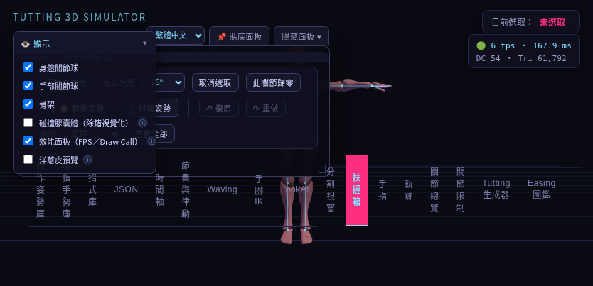
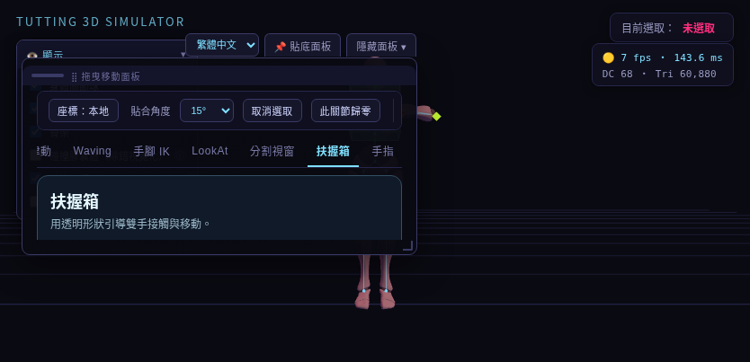

# 浮動面板排版修正

分類：開發與修正 · [文件總覽](../README.md)

## 原因與重現

834 × 403 的桌面視窗中，主面板切為約 440px 寬的浮動視窗後，17 個分頁仍使用可縮小、可逐字換行的桌面規則。禁止換行與橫向捲動原本只定義在手機媒體查詢，因此窄桌面浮動視窗沒有套用。分頁列被撐到 102px 高，上方工具列也折成多排，最後內容區高度成為 0px。

另有兩個相關問題：浮動主面板沒有獨立的顯示層級，可能被「顯示」設定區攔截點擊；高度限制未預留面板上方按鈕的位置，放大後可能把切換／隱藏按鈕推到視窗外。

## 修正與操作

- 分頁固定為單行，寬度限制在主面板內，左右捲動即可存取全部分頁。可使用水平捲動、Shift + 滑鼠滾輪或鍵盤 Tab 導覽。
- 浮動模式的上方工具列也保持單行並可左右捲動，下方分頁內容獨立上下捲動。
- 浮動面板的最小尺寸為 300 × 220px，舊的較小儲存尺寸會自動限制到此範圍；螢幕空間不足時以可用範圍為準。
- 拖曳頂部把手移動，拖右下角調整大小，雙擊把手回到預設位置與大小。
- 切換浮動／貼底、改變語言、視窗縮放及重新載入後，目前選取的分頁會保持在可見範圍。
- 面板縮放會預留上方操作按鈕空間；主浮動面板也會顯示在場景設定區上方，避免點擊被遮擋。

在相同 834 × 403 桌面尺寸中，修正後分頁列高 34px，預設浮動面板內容區恢復為 72px。可放大面板以顯示更多內容。

## 測試圖片

修正前（分頁直排，內容區 0px）：

修正後（水平分頁、可捲動內容及可見的扶握箱分頁）：

圖片來自 Chromium 與鎖定、checksum 驗證的 Three.js／Xbot 測試資料，並非實體手機測試。

## 回歸驗證

`CHROMIUM_PATH=/usr/bin/chromium npm run test:floating` 測試原始與打包入口，在 834 × 403、1280 × 900 與 700 × 360 三種桌面尺寸共六組案例驗證：全部分頁可點選、標籤不直排、不造成頁面溢出、內容區保留可用高度、300px 最窄面板、中英切換、拖曳不改變寬度、縮放後按鈕可見、貼底切換、儲存尺寸重載與選取分頁顯示。

截圖輸出至 `test-results/floating/`；此測試已加入 GitHub Verify workflow。模組、既有桌面、手機、FingerTut 與語言回歸仍由各自的指令驗證。
