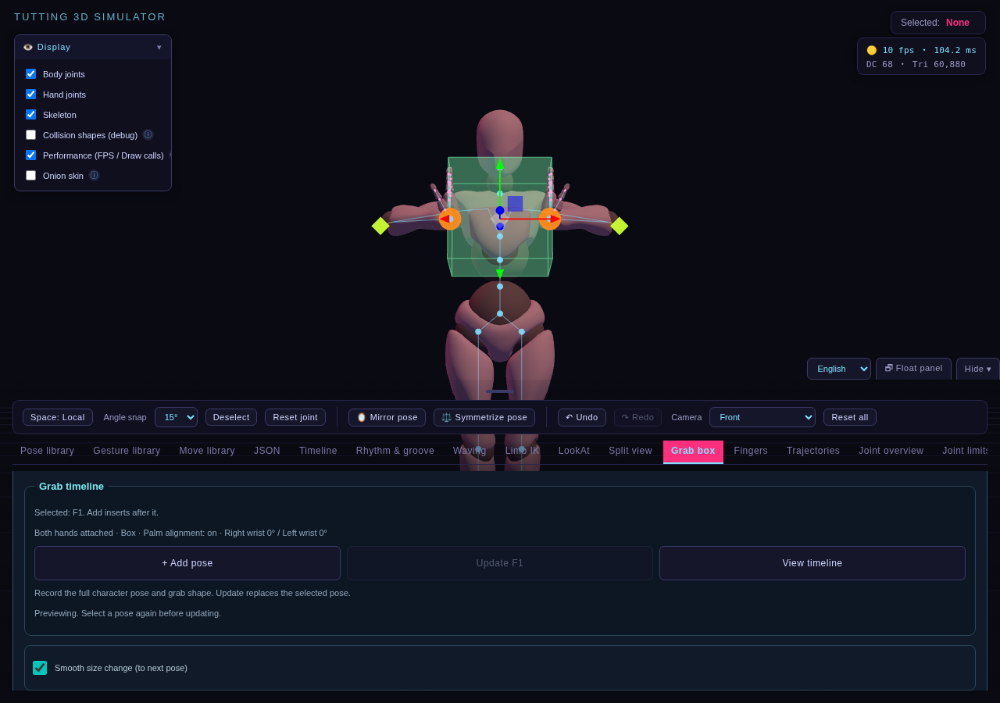
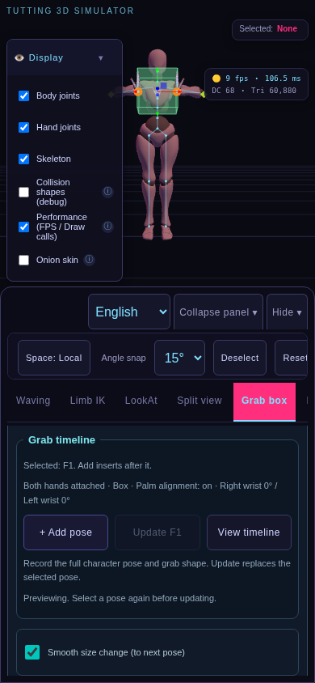
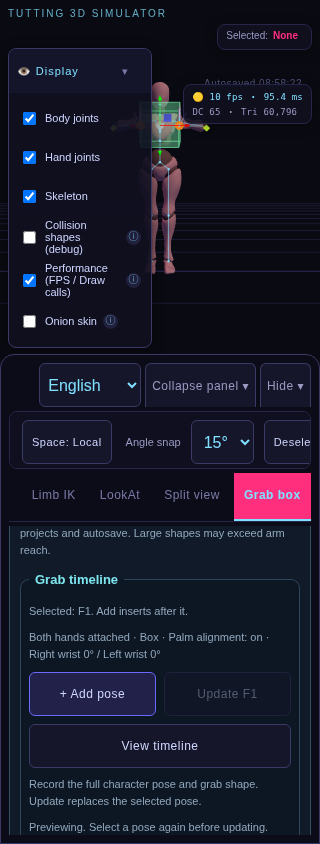
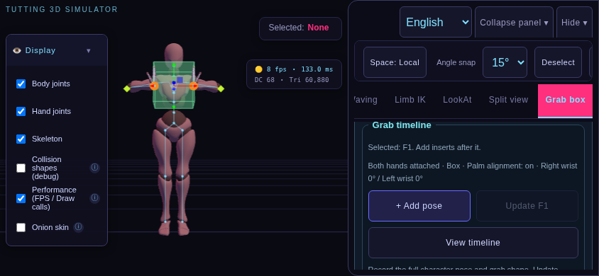

# 扶握箱時間軸第三批 3A：實作與驗測報告

分類：開發與修正 · [文件總覽](../README.md) · 日期：2026-10-07

## 完成範圍

完成第三批 3A「尺寸連續變化」，提供同形狀尺寸插值、表面接觸隨尺寸調整、舊專案相容、可記錄的轉場選項與幾何重用。3B 接觸點滑動、3C 平滑扶握／放手與獨立箱子軌道尚未實作。

| 功能 | 成果 |
| --- | --- |
| 使用者操作 | 扶握箱新增「平順改變尺寸（至下一拍）」勾選項，繁中／英文及至少 44px 點選區 |
| 轉場設定 | 起始拍點決定該段模式，新增／更新時記錄；播放中停用選項，核心亦拒絕變更 |
| 三種形狀 | 長方體寬高深、球體半徑、圓柱半徑高度連續插值 |
| 接觸與朝向 | 保留起始表面的相對接觸位置，尺寸變化後更新 IK 目標及掌面朝向 |
| 舊資料 | 缺少 `sizeTween` 或值不是布林 true，保留尺寸逐拍切換；shape／grabBox／專案版本仍為 1 |
| 歷史與儲存 | 選項進入工作區 snapshot、拍點資料、Undo／Redo、JSON 與自動存檔；選取拍點還原其設定 |
| 幾何更新 | 同形狀重用 geometry、position buffer 與邊框；由不可變頂點基準計算，避免反覆尋位累積誤差 |

## 模組與資料

| 位置 | 變更 |
| --- | --- |
| `src/storage/grab-project.js` | 正規化選用布林 `sizeTween`，舊資料預設 false |
| `src/timeline/grab-state.js` | 保存設定；同形狀尺寸插值與接觸縮放，尺寸 Easing 限制於 0～1 |
| `src/interaction/grab-shapes.js` | 重用頂點基準，原地更新形狀／邊框與 bounding volumes |
| `src/interaction/grab-core.js` | 工作區選項、歷史／還原／播放整合及幾何重用 |
| `src/ui/grab-panel.js`、`grab-timeline.js` | 選項掛載、狀態同步及播放／編輯停用 |
| `src/i18n/grab-timeline-messages.js` | 新增標籤與操作提示翻譯 |
| `tests/grab-size.test.js`、`grab-presets.test.js` | 插值、相容、表面、尺寸限制、幾何隔離與歷史驗證 |
| `scripts/grab-size-smoke.mjs`、Verify | 八組入口／尺寸實測與 CI 診斷 |

`sizeTween` 是起始拍點的轉場設定。只在起始開啟、兩端皆有有效扶握資料且形狀相同時插值；只改目前形狀的尺寸，其餘形狀預設資料保持原拍點值。邊界採下一拍的精確資料，放手不會因 Easing 超越 1 而提前發生。

表面接觸先在起始形狀投影，再依軸向尺寸比例縮放。長方體保留相同面、球體保留方向、圓柱保留側面／端蓋位置比例；下一拍可以有不同接觸配置。幾何保持真實本地尺寸，mesh scale 不變，因此 IK、拾取及表面法向量仍使用同一座標定義。

## 驗測結果

環境為 Linux、Node.js 24 與 Chromium；Three.js 鎖定 0.160.0，Xbot 經 SHA-256 驗證。原始與打包入口由同次程式產生。測試 probe 僅注入測試伺服器，不輸出到產品。

| 項目 | 結果 | 驗證內容 |
| --- | --- | --- |
| 模組測試 | 117／117 通過 | 既有 111 項，加上 5 項尺寸／幾何與 1 項選項歷史測試 |
| 完整 GitHub Verify | 全部通過 | [程式提交 ced5011 的執行結果](https://github.com/Juynwei2019/3D-TUTTING-SIMULATOR-2077/actions/runs/37597945103)：一般、浮動、兩批扶握、尺寸、手機、FingerTut、語言回歸 |
| 打包 | 通過 | `npm run build` |
| 新尺寸瀏覽器測試 | 8／8 通過 | 每組驗證三種形狀、表面接觸、掌面朝向與資料流程 |
| 既有扶握時間軸 | 4／4 通過 | 位置、接觸、朝向、身體、放手、尋位、停止、Undo／Redo、存檔與舊資料 |
| 差異及文件 | 通過 | `git diff --check` 與新增文件／圖片相對連結檢查 |

| 入口 | 1280×900 | 320×844 | 390×844 | 844×390 |
| --- | --- | --- | --- | --- |
| `/index.html` | 通過 | 通過 | 通過 | 通過 |
| `/dist/index.html` | 通過 | 通過 | 通過 | 通過 |

### 純函式與控制器

- 舊拍點缺少旗標及字串旗標，仍採逐拍切換。
- 三種形狀放大／縮小於 0、1/4、1/2、3/4 位置的尺寸與接觸表面正確，來源拍點不被修改。
- Back／Elastic 的超越值被限制在端點尺寸，扶握仍依時鐘邊界切換。
- 切換形狀維持逐拍，終點尺寸與接觸資料精確還原。
- 三種幾何反覆縮放／尋位 100 次，頂點回到基準且 geometry 與 buffer 保持同一物件；新尺寸 bounds 與直接建立的新幾何一致。
- 選項支援單步 Undo／Redo；核心拒絕播放期間修改。

### 八組瀏覽器操作

每組以實際 UI 選擇形狀、預設扶握、掌面貼合、勾選模式與新增兩拍；滑桿輸入遵守原有 0.01m 步進。手機主要按鈕使用 tap，尺寸輸入以 DOM input／change 事件驗證控制器。

- 三種形狀的中點尺寸等於兩端平均，實際 geometry bounds 符合尺寸。
- Xbot 雙手接觸誤差小於 0.015m，掌面法向量與預期方向的 dot 大於 0.98。
- 反向／重複尋位尺寸一致，geometry 與邊框 ID 不變。
- 移除起始旗標重載資料，中點仍保持舊尺寸。
- 繁中／英文、至少 44px 點選區與頁面無水平溢出。
- 工作區選項 Undo／Redo，已儲存拍點不因草稿調整被覆寫。
- 停止後尺寸保持；實際 JSON 下載／上傳、等待最新自動存檔、重新載入後旗標及選取設定保留。
- 沒有 JavaScript pageerror。

GitHub [Verify](https://github.com/Juynwei2019/3D-TUTTING-SIMULATOR-2077/actions/workflows/verify.yml) 加入 `Run grab size regression`；保留一般、浮動、第一／二批扶握、手機、FingerTut 與語言回歸。實際 CI 狀態請查看對應提交。

重現：

```sh
npm ci
npm test
npm run build
node node_modules/playwright-core/cli.js install --with-deps chromium
npm run test:browser
npm run test:grab-size
npm run test:grab-timeline
```

`test:browser` 會在快取缺少時下載官方 r160 Xbot 並驗證 SHA-256，準備 `.cache/Xbot.glb`；尺寸與扶握測試使用該快取。

本機 Node 24 可用 `node --test --test-isolation=none tests/*.test.js`；已有 Chromium 時設定 `CHROMIUM_PATH`。CI 在 Node 22 執行 `npm test`。截圖輸出 `test-results/grab-size/`。

## 實測圖片









## 限制與後續

手機驗證為 Chromium 尺寸與觸控模擬，尚未實測 iPhone Safari／Android。尺寸輸入由事件設定，沒有宣稱完成所有實體手指拖曳；CPU 渲染截圖的 FPS 不作為實機效能測量。

幾何重用已驗證物件與 buffer 身分，尚未做裝置效能基準。非常大的尺寸可能超出 IK 可達範圍。切換形狀、不同接觸配置與放手仍是拍點切換；下一步 3B／3C 需要另外處理表面路徑與 FK／IK 過渡。
