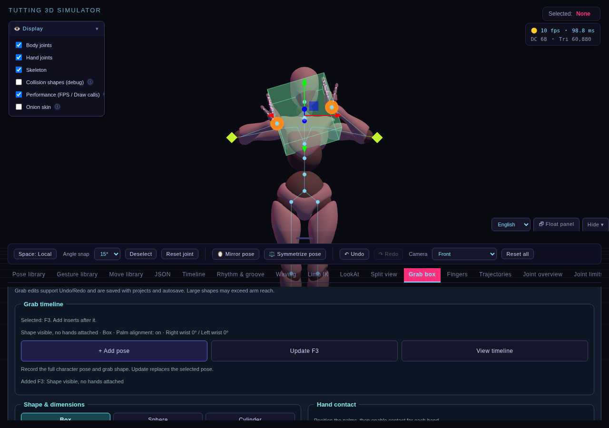
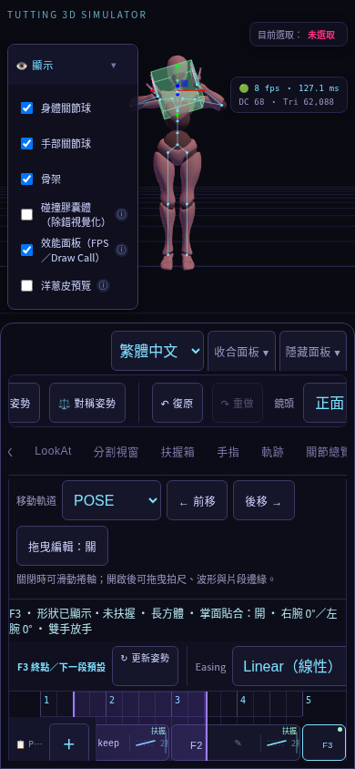
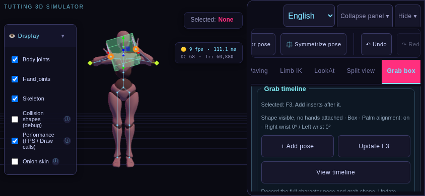
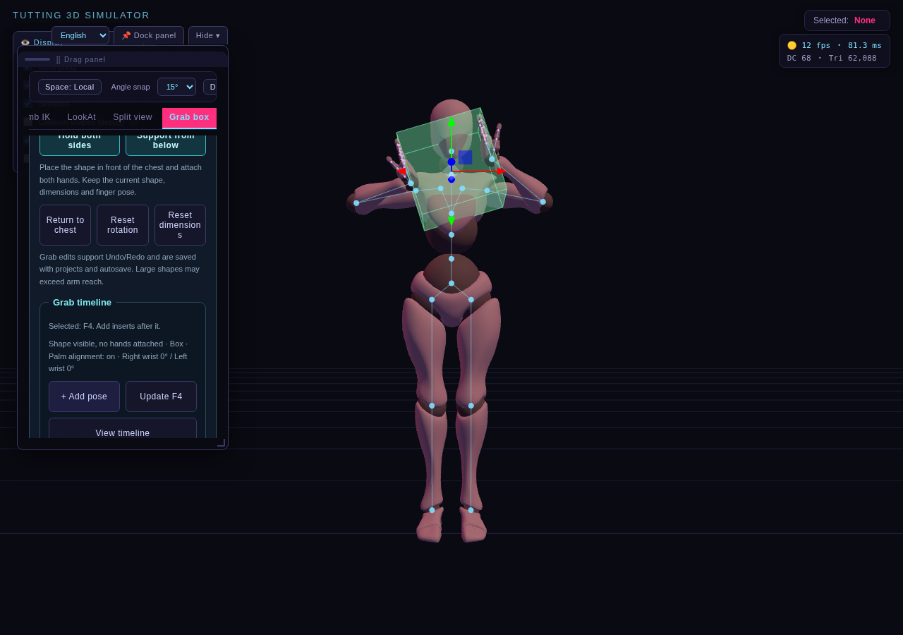

# 扶握箱時間軸第二批：實作成果與驗測報告

分類：開發與修正 · [文件總覽](../README.md) · 日期：2026-10-07

## 實作成果

第二批「操作便利」已完成。扶握箱面板可以直接新增／更新 POSE；時間軸可閱讀扶握狀態與放手事件。沿用第一批 `keyframes[].grabBox.version: 1` 與專案 schemaVersion 1，沒有增加獨立箱子軌道。

| 工作 | 完成內容 |
| --- | --- |
| 2A 快捷記錄 | 新增、更新 F1／F2、查看時間軸；共用姿勢編輯流程，記錄角色與扶握箱，保留原拍點 metadata |
| 操作保護 | 模型未就緒、多選、播放、編輯手勢進行中停用記錄；預覽後須重新選取才能更新，停止時可新增預覽姿勢 |
| 歷史與存檔 | 快捷記錄形成單次 Undo／Redo；沿用自動存檔、專案 JSON 匯出／匯入 |
| 2B 編輯提示 | 區分選取目標與即時場景；比較可儲存的姿勢、身體及扶握資料，提示尚未寫入，排除相機與語言 |
| 拍點摘要 | 有資料標記、六種扶握狀態、形狀、掌面貼合、左右腕角度；提供可讀名稱與手機文字摘要 |
| 相鄰事件 | 左右手開始扶握／放手、隱藏與第一拍初始狀態；排序、貼上、刪除後依鄰接關係重算，不存入 JSON |
| 2C 複製與範圍 | 延用完整項目深拷貝；增加含扶握資料數量回饋，驗證多選、Range 端點、副本隔離與整組復原 |
| 2D 介面 | 快捷按鈕至少 44px，可換行；繁中／英文、320／390px 直向、844px 橫向與 300px 浮動面板 |

## 操作示例

1. 在扶握箱選「雙手扶兩側」，設定掌面貼合，按快捷區「＋新增拍點」。
2. 移動／旋轉形狀，再按新增，依序建立動作。
3. 取消左右手扶握，再新增，形成放手拍點。
4. 按「查看時間軸」閱讀選取摘要與「雙手放手」事件；設定拍數和 Easing 後播放。
5. 要改某拍，重新選取它，完成調整後按「更新 F…」。提示尚未寫入時，場景只是草稿；自動存檔不會自動覆寫拍點。

新增插在有效單選拍點之後，未選取時加入末尾。更新包含整個角色姿勢與箱子，保留備註、拍數、Easing 及其他 metadata。相鄰事件是資料提示，不改變第一批的放手邊界或插值規則。

## 模組與整合

| 位置 | 責任 |
| --- | --- |
| `src/timeline/grab-summary.js` | 純函式：有效資料計數、六種狀態、相鄰事件、穩定姿勢簽章與操作守衛 |
| `src/ui/grab-timeline.js` | 快捷區、目標／場景摘要、草稿比較、預覽狀態與回饋 |
| `src/ui/grab-panel.js`、`styles/simulator.css` | 快捷區掛載、換行、44px 點選區、標記排版 |
| `src/ui/timeline-editor.js`、`index.html` | 拍點標記、可讀名稱與選取摘要 |
| `src/timeline/pose-editor.js`、`transport.js` | 記錄／選取通知、預覽／停止通知 |
| `src/timeline/selection-clipboard.js`、`range-editor.js` | 複製後的 POSE 與扶握資料數量回饋 |
| `src/main.js`、`src/scene/animation-loop.js` | 接線、原時間軸操作保護及節流更新提示 |
| `src/i18n/grab-timeline-messages.js` | 新增訊息的英文翻譯 |
| `tests/grab-usability.test.js`、`scripts/grab-usability-smoke.mjs` | 純函式／編輯驗證與實際瀏覽器操作回歸 |

UI 不直接修改箱子 mesh 或 keyframes；快捷記錄透過共用編輯與歷史 adapter。場景比較忽略鍵順序與微小浮點誤差。提示更新最多每 150ms 一次，成功回饋採非阻擋式狀態文字。

## 驗測方式與結果

本機環境為 Linux、Node.js 24、Chromium，使用鎖定的 Three.js 0.160.0 與 checksum 驗證的 Xbot。打包版由本次程式重建；測試專用 probe 僅注入測試伺服器，不輸出到產品。

| 驗證 | 結果 | 內容 |
| --- | --- | --- |
| 模組測試 | 111／111 通過 | 新增 9 項：六種狀態、舊／無效資料、相鄰事件、姿勢簽章、操作守衛、共享歷史、混合多選深拷貝、Range 與刪除端點 |
| 打包 | 通過 | `npm run build` 產生獨立 `dist/index.html` |
| 第二批瀏覽器 | 8／8 通過 | 下方矩陣，每組執行完整快捷記錄、編輯、存檔流程 |
| 既有一般瀏覽器回歸 | 原始／打包版通過 | 角色載入、共用介面與既有編輯流程，結果以測試輸出為準 |
| 第一批扶握時間軸 | 本機原始桌面通過 | 接觸 IK、插值、放手邊界、停止、存檔；完整四組納入 Verify |
| 程式差異與文件 | 通過 | `git diff --check`，新增文件與圖片相對連結檢查 |

| 入口 | 1280×900 桌面 | 320×568 直向 | 390×844 直向 | 844×390 橫向 |
| --- | --- | --- | --- | --- |
| `/index.html` | 通過，另驗證 300px 浮動面板 | 通過 | 通過 | 通過 |
| `/dist/index.html` | 通過，另驗證 300px 浮動面板 | 通過 | 通過 | 通過 |

八組各自驗證：

- 用實際按鈕新增／更新；手機主要快捷按鈕與分頁使用觸控 tap。
- 移動箱子後顯示未寫入提示；更新保留備註／拍數／Easing，一次 Undo 還原、Redo 恢復。
- 編輯交易中禁止記錄；尋位後禁止快捷及原時間軸更新，停止狀態可新增預覽姿勢。
- 放手摘要、繁中／英文文字、標記與 aria-label；頁面無水平溢出，快捷按鈕至少 44px。
- 部分轉場 Range 複製保留三個姿勢及放手端點；重複整組 Undo／Redo；修改副本不污染原拍點或剪貼簿。
- 多選複製／貼上及記錄保護；排序後放手事件轉為初始狀態／開始扶握。
- 播放中的按鈕保護；實際下載 JSON、上傳匯入，等待最新自動存檔後重新載入，扶握資料一致。
- 桌面兩入口另測實際縮放浮動面板至 300px，英文快捷按鈕可用且不溢出。

純函式／控制器測試補足六種狀態、混合舊拍點、手別變化、刪除與 Range 端點等情境。上述矩陣不代表每種資料組合都在每台裝置實測。

重現命令：

```sh
npm ci
npm test
npm run build
node node_modules/playwright-core/cli.js install --with-deps chromium
npm run test:browser
npm run test:grab-timeline
npm run test:grab-usability
```

本機 Node 24 若受工作區隔離限制，可用 `node --test --test-isolation=none tests/*.test.js`；CI 在 Node 22 使用 `npm test`。已有 Chromium 時可設定 `CHROMIUM_PATH`。新測試截圖輸出 `test-results/grab-usability/`，選用代表圖片保存於本文件。

GitHub [Verify](https://github.com/Juynwei2019/3D-TUTTING-SIMULATOR-2077/actions/workflows/verify.yml) 已加入第二批測試，保留一般、浮動面板、第一批扶握、手機、FingerTut 與語言回歸；失敗時上傳 `test-results/` 診斷。CI 的實際執行狀態請查看對應提交的 workflow。

## 實測圖片

### 桌面快捷區（英文）



### 時間軸標記與放手事件（繁中）


### 手機直向快捷區與時間軸




### 橫向與浮動面板





## 驗證限制與後續範圍

手機結果來自 Chromium 觸控與尺寸模擬，尚未實測 iPhone Safari 或 Android 裝置；截圖中的 CPU 渲染幀率不作為手機效能結論。箱子位移與交易狀態由測試 fixture 設定，第二批測試不宣稱完成所有實體手指的 gizmo 拖曳情境。

尺寸連續變形、接觸點滑動、平滑抓取／放手及獨立箱子軌道仍是後續進階功能。時間軸目前延續完整轉場／端點複製；貼上後的跨接動作由新的相鄰拍點決定。
