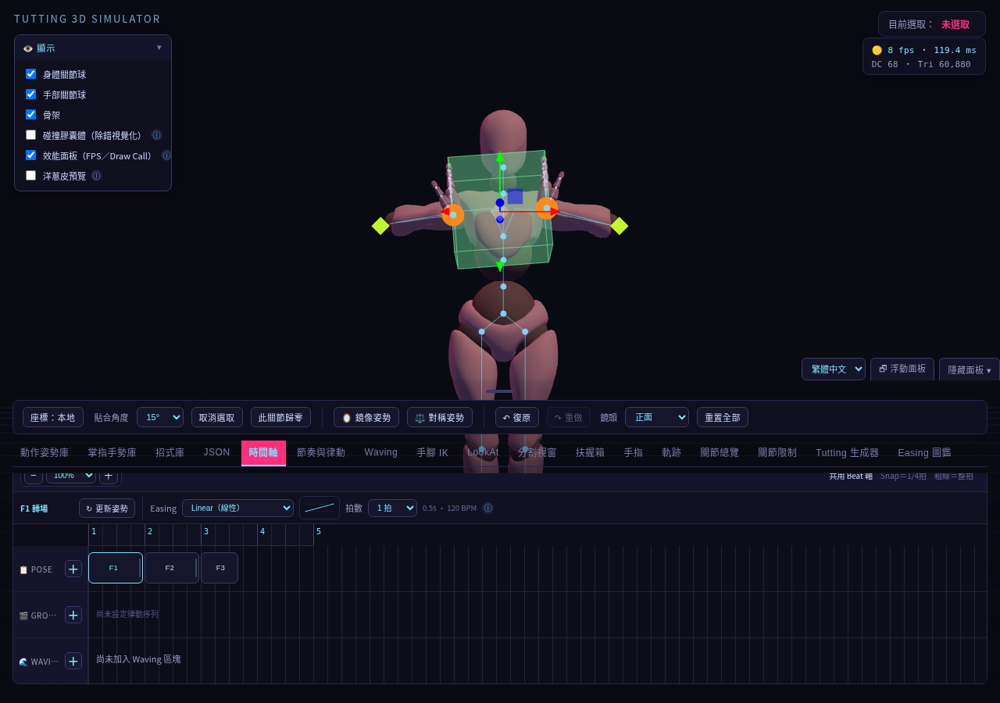
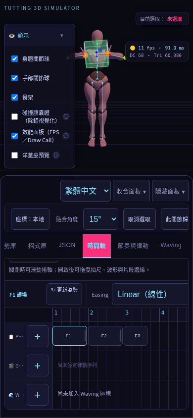
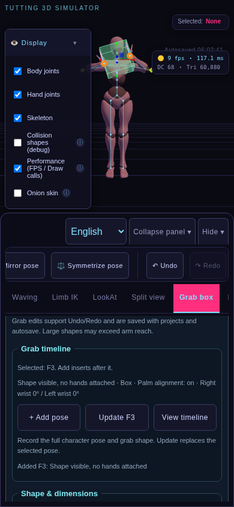
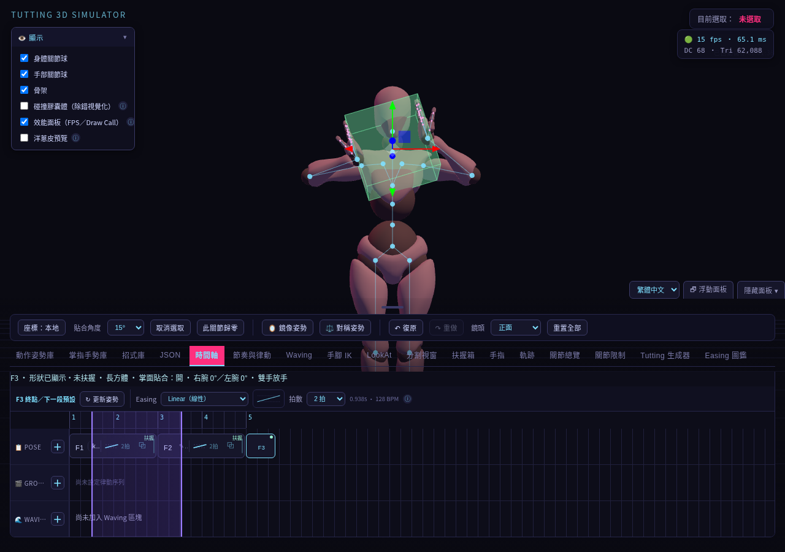

# 扶握箱時間軸：基本整合與操作便利

分類：功能說明 · [文件總覽](../README.md)

扶握箱現在可以跟著現有 POSE 時間軸播放。每個拍點可記錄箱子變換、形狀與尺寸、左右手扶握、箱子本地接觸點、掌面貼合、手腕旋轉及手肘極向點。新增資料為選用的 `keyframes[].grabBox.version: 1`，專案 schemaVersion 仍為 1；它與頂層 `grabBox` 工作區資料分開保存。

## 操作

1. 在「扶握箱」按「雙手扶兩側」或「雙手托底」，需要時勾選「掌面貼合表面」。
2. 切到「時間軸」，按 POSE 列的 **＋新增拍點**。
3. 回到扶握箱，移動或旋轉形狀，再新增下一個拍點。
4. 如需修改已有拍點，先點 F1／F2 選取，調整扶握箱後按 **更新姿勢**。
5. 需要放手時，取消該手的扶握，再新增拍點。
6. 設定拍數與 Easing 後播放。可停止在目前畫面，也可拖動時間軸播放頭預覽。

複製拍點會一併複製扶握資料。拍點新增／更新可復原與重做；時間軸專案 JSON 匯出、匯入與自動存檔都保留這些資料。「JSON」分頁的單一關節姿勢資料不包含箱子動畫。

## 第一批的播放規則

- 位置與旋轉沿用該段拍數和 Easing；旋轉使用四元數插值。
- 手腕旋轉與極向點連續插值，接觸點固定於該段起始箱子的本地座標。
- 顯示／隱藏、形狀、左右手扶握、接觸點與掌面貼合開關在到達下一拍點時切換。即使 Back／Elastic 緩動超越終點，也不會提前放手。
- 尺寸預設逐拍切換；第三批 3A 可在起始拍點啟用 [尺寸連續變化](grab-size-animation.md)。接觸點尚未支援沿表面滑動。
- 扶握中的手臂由箱子接觸 IK 接管；掌面貼合開啟時，手掌朝向依形狀表面求解。手指仍使用拍點手勢。
- 身體姿勢先套用，再求解扶握；扶握關節避開同一段軌跡與律動的覆寫，Wave 與碰撞處理後也會重新求解接觸。超出手臂可達範圍時，IK 仍受實際骨架長度限制。
- 播放中的箱子控制環暫停操作，停止後可繼續編輯。
- 含扶握拍點的專案載入後顯示第一拍，點選拍點會一起套用角色身體與扶握狀態。
- 全部沒有扶握拍點資料的舊時間軸沿用原播放方式；混合時間軸中，沒有扶握資料的拍點代表沒有箱子與扶握。無效的選用扶握拍點資料會被忽略。

## 驗證

`npm run test:grab-timeline` 使用 checksum 驗證的 Xbot 模型與鎖定的 Three.js，在原始／打包入口與 1280／390px 尺寸共四組測試：

- 使用實際按鈕新增、更新拍點與設定扶握。
- 箱子中點位置、重複拖動播放頭的結果、角色身體位置。
- 雙手接觸距離與左右掌面方向。
- 放手邊界、停止後姿勢保持、自然播放到結尾。
- 復原／重做、實際下載 JSON 與上傳匯入、自動存檔重新載入、舊專案相容。

手機案例為 Chromium 手機尺寸與觸控模擬，並非實體手機驗證。截圖輸出至 `test-results/grab-timeline/`，測試已加入 GitHub Verify。

## 第二批：操作便利

扶握箱面板新增「扶握時間軸」快捷區，不用來回切換分頁即可連續記錄。

1. 設定雙手扶握、箱子位置與手掌方向，按 **＋新增拍點**，同時記錄角色姿勢與扶握箱。
2. 繼續移動箱子或放開手，再按新增。新拍點插在目前單選拍點之後，沒有選取時放在末尾。
3. 要修改既有拍點，按 **查看時間軸**、選取 F1／F2，完成調整後按 **更新 F1／F2**。更新保留備註、拍數、Easing 與其他 metadata。
4. 「目前調整尚未寫入 F2」表示場景與已記錄拍點不同；自動存檔保存工作區，不會代替更新拍點。新增／更新後提示清除。
5. 尋位或停止播放後屬於預覽；要覆寫拍點，先重新選取。也可以直接新增，把預覽姿勢記錄成新拍點。

多選、播放、模型載入及調整手勢進行中，新增／更新會暫停；原因直接顯示在快捷區。每次快捷新增／更新支援單步復原與重做。

時間軸含有效扶握資料的拍點顯示「扶握」標記；它代表含設定，隱藏或放手的拍點也會顯示。選取摘要提供雙手／單手／未扶握／隱藏／無資料、形狀、掌面貼合與手腕角度，以及相鄰拍點的開始扶握／放手事件。排序、刪除與貼上後重新計算事件，不存入專案 JSON。

單拍、多選及 Range 沿用完整項目複製，包含端點與扶握設定，副本可獨立編輯。複製回饋顯示實際 POSE 數與含扶握資料數；Range 的拍點數與轉場數分開計算。快捷按鈕至少 44px，支援繁中／英文與 300px 浮動面板。

詳細成果、測試方法、八組尺寸矩陣與圖片見 [第二批實作與驗測報告](../development/grab-timeline-usability-report.md)；原始規格見 [第二批規格](../planning/grab-timeline-usability.md)。

## 第三批 3A

同形狀尺寸動畫已完成，操作見 [尺寸連續變化](grab-size-animation.md)，驗證與圖片見 [實作報告](../development/grab-size-animation-report.md)。3B 接觸點滑動與 3C 平滑扶握／放手仍待實作。
