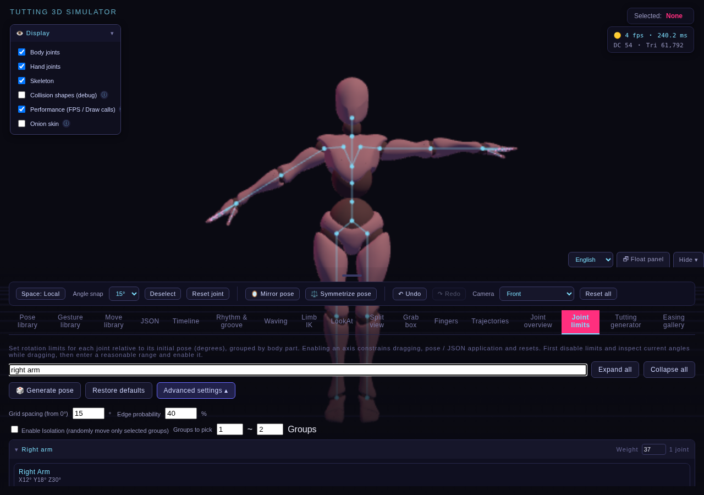
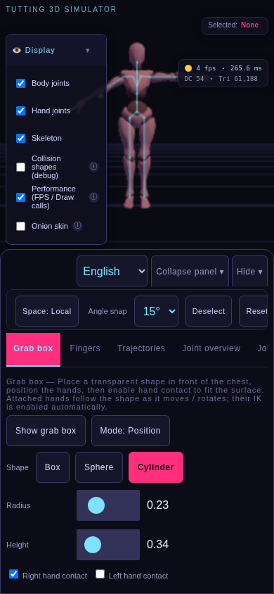
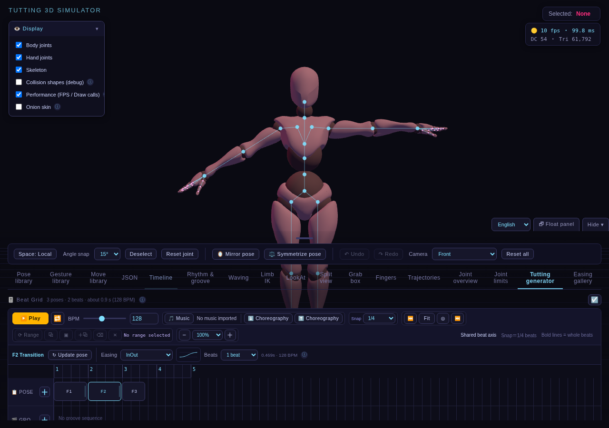
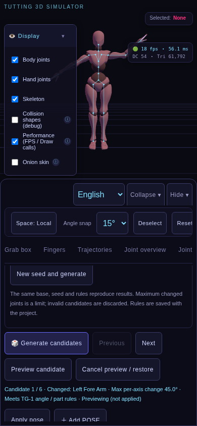
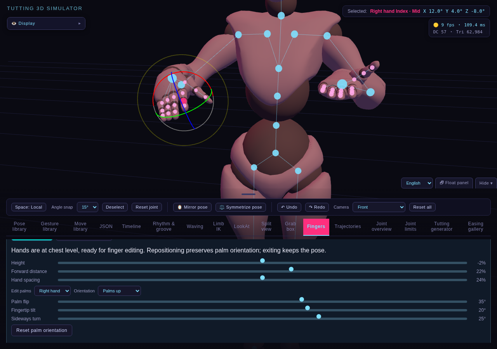
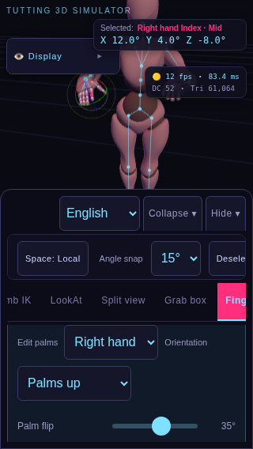

# 語言切換：第一至第三批

分類：功能說明 · [文件總覽](../README.md)

在主面板頂部選擇「繁體中文」或「English」。預設繁中；偏好以 `tuttingLanguage` 保存在目前網站的 localStorage，重新載入會沿用。手機面板收合後仍可切換；若整個面板隱藏，先按「☰ 面板／Panel」。瀏覽器拒絕儲存時仍可在本次操作切換語言。

## 第一批範圍

- 主面板分頁名稱、顯示設定標籤、選取狀態、共用操作、鏡頭選單、Undo／Redo、自動存檔提示。
- 手機面板展開／收合與主面板浮動／貼底文字。
- FingerTut 開啟／退出、胸前位置、手掌方向、單手／雙手、角度混合值、操作說明、扶握阻擋訊息。
- 手指名稱、指節按鈕、指節及 IK 提示、手指浮動視窗標題與收合操作。

## 第二批範圍

- 時間軸：轉場設定、POSE／GROOVE／WAVING 區塊、多選、剪貼簿、範圍編輯、序列與播放狀態。
- 姿勢／手勢／招式／律動資料庫：搜尋、空清單、項目操作、摘要及儲存用量。
- IK、腳掌固定、朝向與朝向軌跡：設定、預覽、控制點及操作狀態。
- Wave：路線節點、波形、幅度、進度、預覽及時間軸操作。
- 律動與生成器：關節名稱、自訂參數、風格原型、種子結果、候選與操作訊息。

## 第三批範圍

- JSON 編輯與對照表：分組、關節顯示名稱、未完成／格式錯誤／未設定回饋、套用錯誤提示。
- 軌跡：路徑與形狀設定、動態半徑／邊數標籤、控制點操作與錯誤提示。
- 關節總覽與限制：分組、名稱、數量、機率／權重、進階設定、Isolation 結果。篩選同時接受中英文與內部 key，不受目前語言影響。
- 扶握：形狀、尺寸滑桿、左右手接觸、位置／旋轉模式。切換語言不重建形狀滑桿。
- 分割視窗標籤、Easing 圖鑑名稱與播放狀態、效能面板提示、模型載入失敗文字。
- 長篇工具提示、檔案／資料庫／儲存錯誤提示，以及 JSON、篩選、限制軸、機率／權重與扶握滑桿的無障礙名稱。圖示按鈕保留可讀名稱；ⓘ 提示可由鍵盤聚焦。手機主面板置於顯示設定覆蓋層之上，避免窄螢幕的長英文標籤遮住語言選單。

語言切換只更新文字與 `html.lang`。不重建控制項、不停止播放、不重置姿勢／IK／鏡頭／模式，不增加歷史記錄。自訂名稱、輸入文字、骨骼 key、分頁 ID、存檔 JSON 格式保留原值；語言偏好不寫入編舞專案檔。

## 模組

- `src/i18n/index.js`：翻譯、插值、語言驗證、偏好容錯、訂閱、DOM 更新與選單綁定。
- `src/i18n/messages.js` 、`src/i18n/batch2-messages.js` 與 `src/i18n/batch3-messages.js`：前三批英文對照。固定的原始繁中文字串作為翻譯 key；缺少翻譯時回退原文。
- `src/i18n/joint-labels.js`：顯示用指節／骨骼名稱；不修改領域定義或內部 ID。

靜態介面使用 `data-i18n` 與對應屬性標記；包含輸入元件的 label 僅翻譯文字 span。動態訊息透過 `t()` 與 `liveText`／`liveAttribute` 保存於既有節點上的更新函式。語言切換只執行文字函式，不重新執行領域操作或重建控制項；WeakMap 不保留已移除的節點。請勿以全文掃描或 MutationObserver 翻譯自訂名稱。

## 驗證

第三批驗證：82 項模組測試、打包、桌面回歸、6 組手機回歸、8 組 FingerTut 情境與 8 組完整語言情境。

`npm test` 涵蓋預設／不支援語言、缺字回退、插值、儲存被拒、訂閱及字典參數一致性。

`npm run test:fingertut` 同時測試原始與打包入口，在 1280×900、320×568、390×844、844×390 驗證雙語文字、姿勢／模式／鏡頭與專案資料保留、自訂名稱保留、播放不中斷、Undo／Redo、混合角度、手機收合選單、浮動視窗與重新載入偏好。截圖輸出至 `test-results/fingertut/*-english.png`。

`npm run test:language` 在原始與打包入口，各以 1280×900、320×568、390×844、844×390 檢查全部 17 個分頁的英文文字與頁面溢出，並實際操作多選／複製、候選生成、律動生成、Wave 預覽、IK 及朝向控制點；核對切換前後資料、控制項身分、自訂名稱、未儲存輸入與重新載入偏好。截圖輸出至 `test-results/language/`。第三批再驗證未完成 JSON 與格式錯誤的雙語回饋、有效數值不被舊訊息覆蓋、未儲存限制輸入、雙語篩選、Tooltip 遷移、扶握滑桿／接觸、軌跡控制點，以及 Easing 動畫節點與播放狀態保留。此測試已加入 GitHub Actions；完整回歸的逾時上限為 20 分鐘。語言測試的 WebGL 畫布使用 0.5 像素比例以減少軟體 GPU 成本；CSS 視窗尺寸、介面截圖解析度與功能斷言保持原值，既有桌面／觸控回歸仍使用原本渲染設定。

前三批已涵蓋目前各分頁的程式介面文字。語言選單保留各語言原名；自訂名稱、預設資料項目名稱、檔名與 JSON key 保留原值；原生瀏覽器／JavaScript 錯誤細節沿用系統原文，程式提供的錯誤提示會翻譯。手機驗證使用 Chromium 裝置模擬，仍需 iOS Safari／Android 實機確認。

## 第三批介面截圖

## 第二批介面截圖

## 第一批介面截圖

