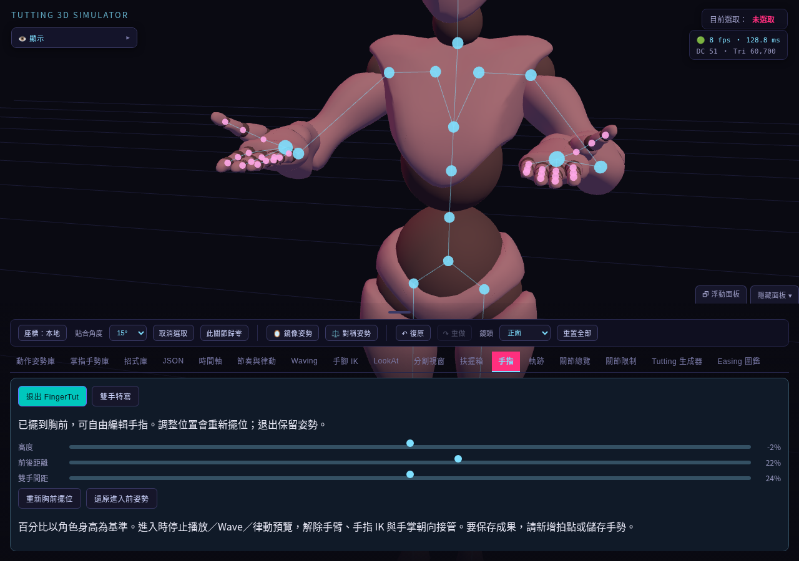
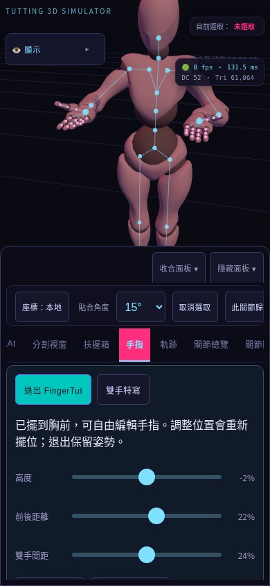
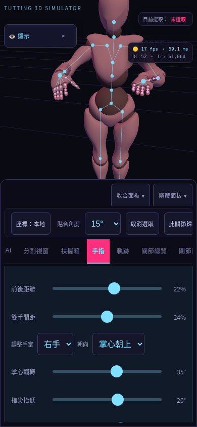

# FingerTut 胸前編輯模式

在「手指」分頁按 **開啟 FingerTut**，雙手會擺到胸前，掌心朝下、指尖朝前，並切換雙手特寫。現有手指角度保留。

- 高度：相對胸部，預設為身高的 -2%。
- 前後距離：預設為身高的 22%。
- 雙手間距：左右手掌中心距離，預設為身高的 24%。
- 調整滑桿並放開後重新擺位；「重新胸前擺位」保留目前三個參數。
- 手掌朝向：選雙手／右手／左手，套用掌心朝下、朝上、相對、朝外或朝向鏡頭。
- 角度：掌心翻轉 ±180°，指尖抬低與左右偏轉 ±90°；雙手採鏡像語意，單手調整不影響另一手。
- 選擇朝向預設會將該手的微調角度歸零。「重置手掌朝向」只重置所選手掌，保留手指形狀及手掌位置。
- 左右設定不同時，雙手選項顯示「左右不同」或角度「不同」；移動滑桿會將該項角度套用到雙手。
- 調整方向不會移動鏡頭或重新擺位；若所選手掌受手臂／手指 IK 或 LookAt 接管，會先解除該側接管並保留當下指節角度。
- 「朝向鏡頭」對準按下時的鏡頭，方向以胸部座標保存，不持續追蹤鏡頭。
- 重新擺位、調整胸前位置或雙手間距，都保留各手設定的朝向與角度。
- 「雙手特寫」只調整鏡頭，並收合可能遮住手掌的顯示面板。
- 「退出 FingerTut」保留成果；「還原進入前姿勢」還原原始姿勢、雙臂／手指 IK 與手掌朝向狀態、目標位置及鏡頭。
- 模式操作支援 Undo／Redo。相同參數不重複產生歷史記錄。

這是進入時擺位的編輯工作區，不會持續跟隨胸口。移動角色或修改身體後，可重新擺位。進入或重新擺位會停止時間軸播放、Wave、律動預覽，解除手臂／手指 IK 與手掌朝向接管；還原不會重新啟動播放。扶握中需先解除雙手扶握。

要跨次開啟保存姿勢，請新增拍點；手指形狀則可存入掌指手勢庫。模式開關、還原點與鏡頭不寫入專案檔，載入專案會清除模式工作區。

## 驗證結果

初版驗證：71 項單元測試、打包、原始／打包入口桌面回歸、6 組既有手機回歸與 8 組 FingerTut 情境通過。指尖朝向與掌心朝向點積約為 0.993 與 -0.993；雙手位置符合預設比例。

手掌朝向擴充驗證：74 項單元測試與 8 組 FingerTut 情境通過，涵蓋五種預設、鏡像角度、單手編輯、手指 IK 衝突、Undo／Redo、重新擺位與間距調整保留朝向。

## 測試方式

使用鎖定版本的 Three.js、經 SHA-256 驗證的 Xbot 模型與 Playwright Chromium。測試服務只在被測程式注入讀取 adapter；正式程式不含測試全域物件。

```sh
npm test
npm run build
npm run test:browser
npm run test:mobile
npm run test:fingertut
```

本機已有 Chromium 時，可在瀏覽器指令前設定 `CHROMIUM_PATH=/usr/bin/chromium`。

FingerTut 測試在原始入口與打包入口，分別使用 1280×900、320×568、390×844、844×390，共 8 組情境：

1. 切換手指分頁，拍攝進入前畫面。
2. 設定非零指節角度、啟用手臂與手指 IK，開始時間軸播放。
3. 按開啟模式，確認播放停止、IK 接管解除、30 個指節角度保留。
4. 量測雙手相對胸部位置：高度 -2%、前方 22%、左右各 12%；驗證掌心朝下及指尖朝前。
5. 確認頁面無水平溢出、顯示面板收合，拍攝模式畫面。
6. Undo／Redo 驗證模式與原有 IK 開關、目標還原。
7. 套用五種朝向預設，量測掌心方向；驗證手掌位置、手指角度與鏡頭保持不變。
8. 啟用手指 IK 後編輯手掌，驗證接管解除且當下手勢保留。
9. 單手調整、三軸角度、左右不同顯示、重置與 Undo／Redo，以及重新擺位保留朝向。
10. 改雙手間距至 32%，包含重複 change 事件；一次 Undo 回到 24%。
11. 退出保留姿勢；按還原按鈕，驗證同步還原的姿勢及原有 IK 目標。
12. 全程確認沒有 JavaScript 執行錯誤。

啟用中的 IK 還原後會繼續求解，因此還原姿勢在按鈕事件結束時驗證，避免把下一幀求解的正常變化視為還原失敗。

測試輸出在 `test-results/fingertut/`，包含前後 PNG 與位置量測 JSON。CI 自動執行此測試；失敗會輸出註解與診斷截圖。

以下為實際瀏覽器截圖，不是設計示意圖。手機畫面是觸控瀏覽器模擬；iPhone Safari／Android Chrome 實機仍待驗證。截圖使用雲端軟體渲染，效能面板讀值不代表手機實機幀率。





手掌朝向操作畫面：


