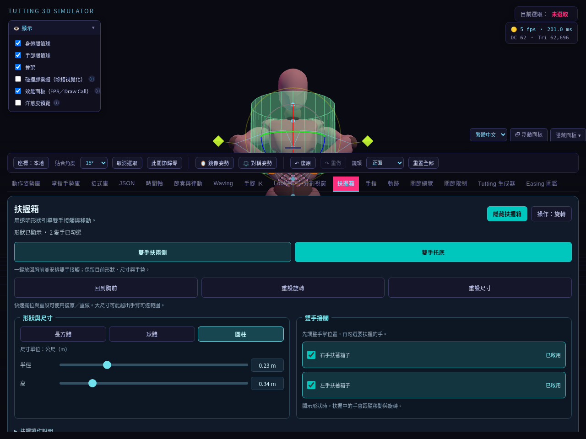
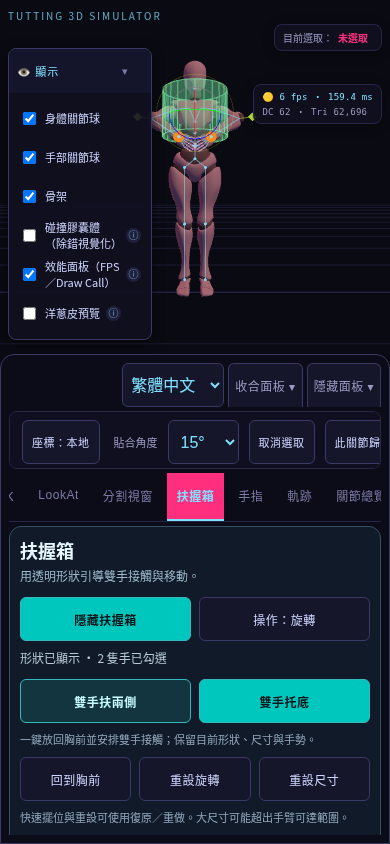
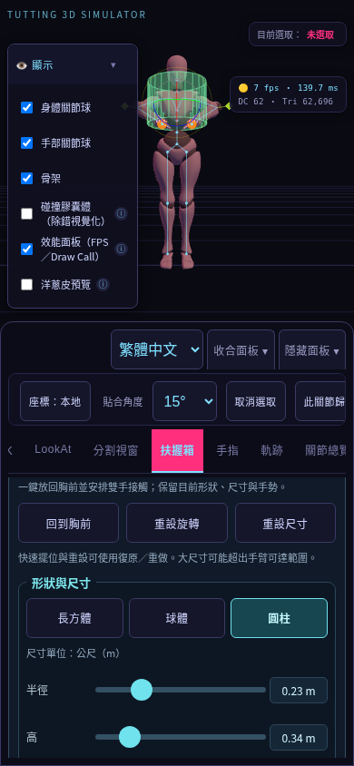
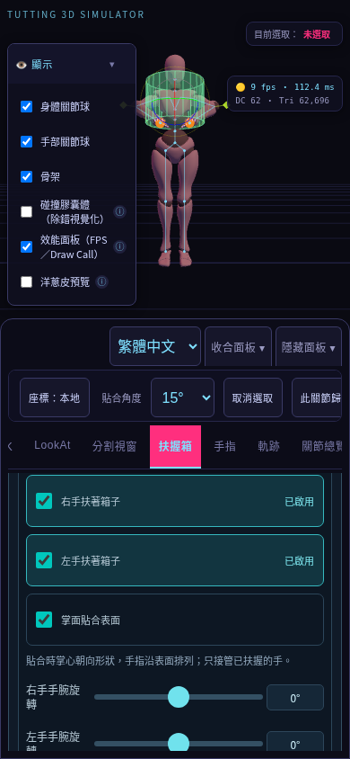
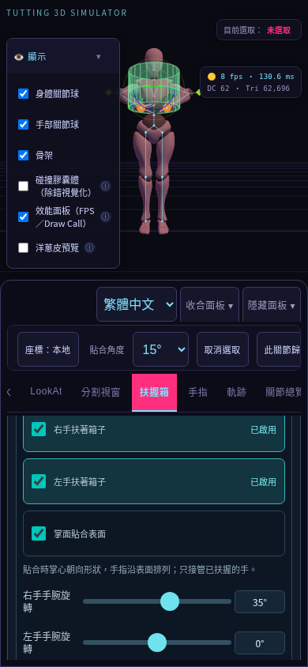

# 扶握箱模式

到「扶握箱」分頁，用透明形狀引導手掌接觸；形狀顯示時，已勾選的手會隨形狀移動與旋轉。

## 新版介面

- 頂部集中「顯示／隱藏扶握箱」與「操作：移動／旋轉」，並顯示形狀是否可見、幾隻手已勾選。
- 「形狀與尺寸」卡片提供長方體、球體與圓柱。滑桿旁顯示數值及公尺（m），選中的形狀有顏色與按下狀態。
- 「雙手接觸」卡片分別控制右手、左手；勾選項目會高亮並顯示「已啟用」。
- 桌面兩張卡片並排，手機與窄面板上下排列。手機尺寸滑桿的觸控範圍至少 44px 高。
- 「扶握操作說明」可展開查看完整步驟。介面支援繁體中文／English，切換保留尺寸、形狀、操作模式與勾選狀態。

## 一鍵雙手扶握與重設

不用先逐隻手調整，可直接按：

- **雙手扶兩側**：將形狀放回角色胸前並對齊軀幹，安排右手、左手到兩側的對稱接觸點。
- **雙手托底**：同樣放回胸前，將雙手安排到底部。球體使用下半部兩個對稱點，長方體與圓柱使用底面兩個點。

兩種操作會自動顯示形狀、開啟雙臂 IK，保留目前形狀、尺寸與手指手勢。為避免固定在世界座標的指尖目標改變手勢，一鍵擺位會關閉手指 IK；撤銷可恢復操作前的手指 IK 開關與目標。形狀移動或旋轉時，雙手持續跟隨；切換形狀或調整尺寸，也會依目前預設重新安排對稱接觸點。取消任一手扶握後，退出雙手預設，另一手仍可繼續扶握。

| 按鈕 | 處理內容 | 保留內容 |
| --- | --- | --- |
| 回到胸前 | 重新依角色目前胸口與朝向定位 | 旋轉、形狀、尺寸、扶握狀態 |
| 重設旋轉 | 對齊角色目前軀幹方向 | 位置、形狀、尺寸、扶握狀態 |
| 重設尺寸 | 將目前形狀改回預設尺寸 | 其他形狀的尺寸、位置、旋轉、扶握狀態 |

預設尺寸：長方體 0.32 × 0.32 × 0.24 m；球體半徑 0.18 m；圓柱半徑 0.14 m、高度 0.34 m。重設不會自動顯示隱藏的形狀。

所有扶握箱編輯都支援頂部「復原／重做」（桌面亦可 Ctrl／Cmd + Z、Shift + Ctrl／Cmd + Z）：顯示／隱藏、操作模式、形狀與尺寸、左右手扶握勾選、快速擺位／重設、掌面貼合與手腕旋轉。一次尺寸滑桿調整或三維移動／旋轉拖曳，放開後只記錄一次編輯；一次復原即可回到操作前。復原與重做會還原形狀變換、接觸點及雙臂／手指 IK 的開關與目標，並更新面板。未改變數值的操作不新增完成紀錄。

FingerTut 開啟時，快速擺位、重設及掌面貼合設定會提示先退出 FingerTut，並保留目前狀態；在「手指」分頁退出後即可操作。執行成功的快速擺位／重設會停止拍點播放及動作預覽，讓手臂 IK 可以接管。

大尺寸或特殊姿勢可能超出手臂可達範圍，勾選成功不代表手掌一定到達表面；可縮小形狀或調整角色姿勢。

## 手掌朝向貼合

在「雙手接觸」勾選 **掌面貼合表面**，讓已扶握手的掌心朝向形狀，手指方向沿表面排列。此選項預設關閉，開啟後會持續跟隨形狀的移動、旋轉與尺寸變更：

- 長方體：依接觸面朝向；角落採固定的面選擇，避免方向不確定。
- 球體：依接觸點的曲面法向。
- 圓柱：側面依徑向，底面與頂面依端蓋方向；端蓋邊緣採側面方向。
- 雙手扶兩側通常手指朝上；托底通常手指朝前，雙手掌心依各自接觸點貼合。

**右手手腕旋轉／左手手腕旋轉** 可各自調整 −180°～180°，旋轉手指沿表面的方向，同時維持掌面貼合。滑桿放開後套用；0° 回到預設方向。開關及角度支援「復原／重做」，切換語言保留狀態。

只有顯示形狀且已扶握的手會被接管。該手原有「末端朝向」、「手掌朝向」與朝向路徑設定保留，貼合期間暫停其朝向計算；解除該手扶握、隱藏形狀或關閉貼合後，恢復既有控制。若未啟用其他朝向控制，關閉貼合會保留目前手腕姿勢，可繼續手動編輯。

開啟貼合時，會關閉已扶握手的手指 IK，以保留當下手勢，避免指尖世界座標目標因手腕轉動而改變手勢。撤銷可還原原有手指 IK。貼合已開啟後新勾選扶握的手，也會關閉該手手指 IK；其他手不受影響。

這是掌面方向對齊，接觸位置仍使用手部 IK 骨骼位置，尚未加入掌厚偏移、手指包覆、可達性判定或接觸壓力模擬。播放拍點時沿用已記錄的姿勢，不另套用即時貼合。

## 基本操作

1. 按「顯示扶握箱」，讓透明形狀與三維操作軸出現。
2. 選擇形狀，用滑桿調整尺寸。長方體可調寬／高／深，球體調半徑，圓柱調半徑／高度。
3. 先調整手掌位置，再勾選右手或左手「扶著箱子」。需要時，程式會自動開啟該手臂 IK。
4. 拖曳三維操作軸搬動形狀；按「操作：移動」切換成旋轉模式，再拖曳旋轉環。按鈕文字顯示目前模式，提示文字顯示下一個可切換的模式。
5. 取消某隻手的勾選可解除該手接觸；按「隱藏扶握箱」則解除雙手扶握。解除扶握不會關閉手臂 IK，若要改回手動旋轉手臂，請到「手腳 IK」關閉該側 IK。

切換形狀或尺寸時，已扶握的手會重新對應到表面。調整尺寸及切換語言不會重建目前形狀的滑桿；切換形狀種類才更新對應的尺寸欄位。已勾選但形狀隱藏時，手不會跟隨形狀移動；先顯示形狀再操作。

若要啟用 FingerTut 胸前擺位，先取消雙手扶握，避免兩個操作同時接管手臂。詳見 [FingerTut 模式](fingertut-mode.md)。

## 實際介面截圖

以下為新版繁體中文介面的瀏覽器截圖：圓柱半徑 0.23 m、旋轉模式、雙手托底已啟用。手機使用 Chromium 觸控模擬；效能讀值不代表實機幀率。

往下捲動查看形狀與尺寸：

往下捲動面板，調整左右手接觸：

掌面貼合與左右手獨立旋轉：

## 儲存與還原

完成扶握箱編輯後，約 1.5 秒會自動存入目前瀏覽器的 localStorage。重新整理頁面時選擇還原，即可恢復形狀、各形狀尺寸、位置、旋轉、顯示與操作模式、左右手接觸點、預設擺位、掌面貼合及手腕旋轉。形狀顯示時也還原當下關節姿勢、角色位置與雙臂／手指 IK 工作區。取消還原會清除該份自動存檔；自動存檔不會跨瀏覽器或裝置同步。

要保存至檔案或移至其他裝置：

1. 到「時間軸」按「⬇ 編舞」（匯出整份編舞 JSON），下載包含扶握箱工作區的專案檔。只要編輯過扶握箱，即使沒有拍點也能匯出。
2. 在另一個工作區按時間軸的「⬆ 編舞」（匯入整份編舞 JSON），選取檔案並確認覆蓋。
3. 匯入後可使用「復原／重做」恢復匯入前後的工作區。

這與「JSON」分頁的關節姿勢輸入不同；扶握箱需使用**時間軸專案 JSON**。專案仍採 schemaVersion 1，新增選用的 `grabBox.version: 1` 欄位，舊檔案仍可匯入。載入沒有扶握箱資料的舊檔，會隱藏形狀並解除目前扶握，避免沿用上一份工作區的綁定；原有時間軸姿勢與身體變換照常載入。無效形狀尺寸或變換不會套用；不合法接觸點會解除該手扶握。隱藏形狀的專案沿用原有首拍姿勢載入方式。

## 驗證與截圖更新

可使用 `CHROMIUM_PATH=/usr/bin/chromium node scripts/capture-grab-ui.mjs` 更新五張繁體中文截圖；需先安裝依賴、具備 Chromium 與 `.cache/Xbot.glb` 模型快取。

`npm run test:language` 在原始與打包入口、1280／320／390／844px 四種畫面驗證三種形狀與尺寸欄位、選取狀態、顯示／隱藏、移動／旋轉、尺寸數值、雙手接觸、掌面貼合與獨立手腕旋轉、隱藏後解除扶握、響應式布局與語言切換時保留 DOM／核心狀態。截圖輸出至 `test-results/language/*-grab-en.png`。

`npm run test:browser` 另檢查三種形狀的兩種預設、實際雙手骨骼到達表面及掌面方向、朝向接管、獨立重設、Undo／Redo、連續尺寸編輯、拖曳交易、零拍點專案匯出／匯入、匯入撤銷、扶握箱自動存檔重載、舊檔解除綁定、FingerTut 阻擋，以及扶握、IK 自動開啟、切換形狀與隱藏解除等既有流程。測試使用鎖定的 Three.js 與經 checksum 驗證的模型，不代表正式 CDN 的連線測試。

首次使用可參考 [基礎圖文操作手冊](basic-user-manual.md)。

## 扶握箱時間軸

扶握箱已支援逐拍記錄、移動／旋轉播放、雙手跟隨、掌面貼合與放手切換。操作與第一批規則請見 [扶握箱時間軸](grab-timeline.md)。
